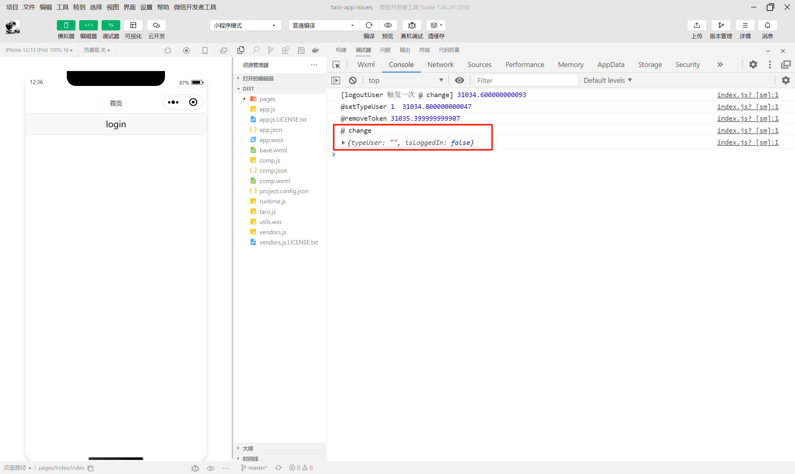
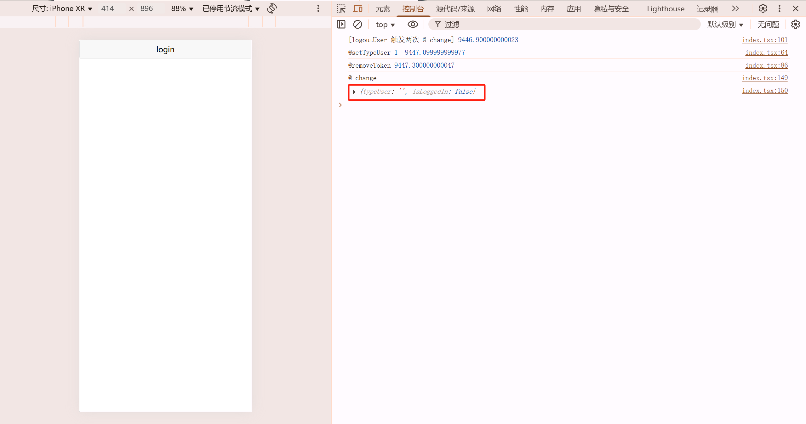

# Tarojs + @tanstack/react-query 小程序端重复运行 effect 的 bug

> [!NOTE]  
> 请先修改`project.config.json`的appid.

## 重现步骤
1. 安装依赖
2. 运行 `npm run dev:weapp`
3. 执行登录操作之后 点击 `logoutUserTwice` 按钮, `@ change` 会触发两次
 
4. 点击 `logoutUserOnce1` / `logoutUserOnce2` / `logoutUserOnce3` / `logoutUserOnce4`  `@ change` 均只会触发一次
 
5. 运行 `npm run dev:h5` 登录操作之后所有退出操作按钮 `@ change` 均只会触发一次
 


## 期望的结果 
所有退出登录的操作之后触发一次  `@ change` 副作用

## 实际的结果
- H5 符合预期
- 微信小程序的退出登录操作中 `submitLogout` 代码顺序在 `setTypeUser` 和 `setTypeUser` 之前的时候，会触发两次


## 补充说明 
退出操作的 `submitLogout('123')` 和 `setTypeUser('', 1)`和 `removeToken()` 不应该都是同步执行的吗( mutate 换成 mutateAsync 也是一样的)？
他们的顺序应该对  `@ change` 的影响只有一次才对(参考H5端，顺序丝毫不影响), 为什么小程序执行了两次？除非`setTypeUser` 或者 `setTypeUser` 有一个操作在`submitLogout` 前面

```ts
  useEffect(() => {
    console.log('@ change')
    console.log({ typeUser, isLoggedIn })
  }, [typeUser, isLoggedIn])

  // 退出登录
  const logoutUserTwice = useCallback(() => {
    console.log('[logoutUser 触发两次 @ change]', performance.now())
    submitLogout('123')
    setTypeUser('', 1)
    removeToken()
    queryClient.clear()
  }, [queryClient, removeToken, setTypeUser, submitLogout])

```
